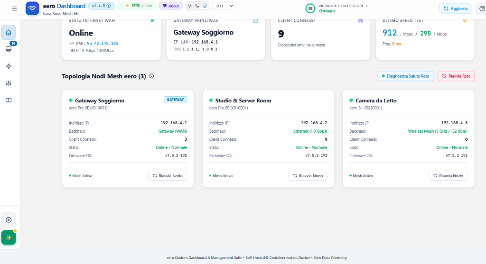

# eero Custom Dashboard & Mesh Management Suite 🚀

[](https://opensource.org/licenses/MIT)
[](https://hub.docker.com/r/enricoflammini/eero-dashboard)
[](#)
[](https://www.python.org/downloads/)
[](https://fastapi.tiangolo.com)
[](#)
[](#-acknowledgements--ai-assistance)

> **Language / Lingua:** [🇬🇧 English](#-english) | [🇮🇹 Italiano](#-italiano)

<p align="center">
  
</p>

---

<a name="english"></a>
# 🇬🇧 English Documentation

Self-hosted, containerized web dashboard and management suite for **Amazon eero** mesh Wi-Fi networks. Features authentic certified hardware telemetry, real-time traffic monitoring, DHCP static IP reservation with collision detection, port forwarding rules, speed testing history, dynamic guest Wi-Fi QR generator, one-click gaming focus mode, native in-app AdGuard Home DNS sync, and interactive documentation.

---

## 📸 Screenshots Showcase

<div align="center">

| Dashboard & Mesh Topology | Speed Test & Analytics |
| :---: | :---: |
|  |  |

| Device Details & Static IP (DHCP) |
| :---: |
|  |

</div>

---

## 🌟 Key Features

* **📊 Mesh Topology & Health Score:** Live overview with Network Health Score (1-100), WAN public IP, gateway status, DNS servers, ISP information, and individual eero nodes (Gateway & Beacons) with backhaul type (`Ethernet (Wired)` vs `Wireless Mesh`).
* **🔄 1-Click Docker In-App Auto-Update & Version Checker (v1.04.00):** Continuous background and manual version checking against Docker Hub and GitHub Releases, animated update alert badge in the header, and 1-click in-app container recreation via Docker socket (`/var/run/docker.sock`), Watchtower webhooks, or assisted terminal commands.
* **📶 Wi-Fi Signal Quality & Mesh Coverage Analytics (v1.04.00):** Continuous SQLite storicization (`device_signal_history`) of client RSSI levels (dBm), frequencies and PHY rates, household average signal score, interactive Chart.js time-series analysis (24h/7d), and a Weak Signal Watchlist with mesh repositioning suggestions.
* **🖥️ Certified Hardware Telemetry & Interactive Sorting:** Full client table with explicit frequency band badges (**2.4 GHz, 5 GHz, 6 GHz, Wired Ethernet**), wireless channels (`CH 11`, `CH 36`, etc.), eero Cloud User Profiles integration (`👤 [Profile Name]`), connected mesh node, RSSI signal strength (dBm), negotiated physical PHY rate, **Static IP vs Dynamic DHCP indicators**, **interactive column sorting (Name, IPv4, Node, Band, Signal, Status)**, and a **locked sticky header bar**.
* **🛡️ Native In-App Multi-Instance AdGuard Home Sync:** Dedicated visual configuration panel to seamlessly sync eero device nicknames, MAC addresses, official tags (`device_laptop`, `device_phone`, `device_pc`, `device_tv`, etc.), and static/dynamic IP leases directly to **one or multiple AdGuard Home DNS servers** (e.g. Primary and Secondary DNS) with automatic background synchronization.
* **⚙️ DHCP Reservations & Port Forwarding:** Dedicated device modals with custom nicknames (synced to eero cloud), categories, local documentation notes, favorite flags (⭐), **DHCP static IP reservations with reassignment support**, and integrated **Port Forwarding rule management** (WAN port -> LAN port, TCP/UDP).
* **🌍 Real-Time Multi-Language (i18n):** Native bilingual interface (**English 🇬🇧 default / Italian 🇮🇹**) with instant live switcher and permanent preference persistence.
* **⚡ Speed Test & Performance Analytics:** Manual and scheduled automated speed tests (e.g. every 12 hours) with historical charts (Download, Upload, Ping/Latency) and aggregate statistics.
* **📱 Dynamic Guest Wi-Fi QR Code:** Scannable Wi-Fi QR Code generator (`WIFI:S:...;T:WPA;P:...;;`) with one-click enable/disable and secure password generation.
* **🎮 One-Click Gaming Focus Mode:** Low-latency automation that temporarily pauses non-essential streaming/IoT devices to eliminate jitter during competitive gaming or video calls.
* **🔔 Telegram Bot, Webhook Alerts & Daily Digest:** Instant notifications on new unknown device connections (Intruder Alert) and offline mesh nodes, backed by a **persistent SQLite registry (`known_devices`)** ensuring zero duplicate alerts on container restarts, plus dedicated activation toggles and rich live daily digests.
* **📖 Interactive In-App User Manual & Changelog:** Fully searchable embedded documentation, release notes summary with GitHub link, and dedicated About & Open Source modal.
* **🛡️ Zero-Latency RAM Cache:** Asynchronous in-memory background poller eliminating eero API rate-limiting.
* **✨ Demo Mode Simulator:** Test and explore all dashboard features without real credentials.

---

## 🛠️ Tech Stack

* **Backend:** Python 3.12 (`python:3.12-slim-bookworm`), FastAPI >= 0.115, Uvicorn >= 0.32, Pydantic v2, `asyncio`.
* **HTTP Client:** `httpx` (async client for eero REST API 2.2).
* **Storage:** Async SQLite with `aiosqlite` (WAL mode).
* **Frontend:** Semantic HTML5, Vanilla CSS / Tailwind CSS, Alpine.js (v3.14+), Chart.js (v4.4+).
* **Containerization:** Docker & Docker Compose (Multi-Arch `linux/amd64` & `linux/arm64`).

---

## 🚀 Quick Start

### Option A: 1-Line `docker run` (Recommended)

Run instantly from **Docker Hub** without needing to clone or compile locally:

```bash
docker run -d \
  --name eero-dashboard \
  -p 8085:8000 \
  -v $(pwd)/data:/app/data \
  -e TZ=Europe/Rome \
  --restart unless-stopped \
  enricoflammini/eero-dashboard:latest
```

### Option B: Docker Compose

```bash
# 1. Clone repository
git clone https://github.com/EnricoFlammini/Dashboard_EERO.git
cd Dashboard_EERO

# 2. Start container
docker compose up -d
```

Access the dashboard in your browser:
👉 **`http://localhost:8085`** (or your server's IP, e.g. `http://192.168.1.100:8085`).

> [!TIP]
> **🔄 Container Update & Browser Cache Notice:**
> When updating your container to a newer image version, static assets include cache-busting version strings (`?v=...`). If your browser has cached older JavaScript or CSS files, perform a hard reload (`Ctrl + F5` on Windows/Linux or `Cmd + Shift + R` on macOS) or clear your browser cache to ensure all new interface features load properly.

---

## 🔑 Authentication & Login Methods

1. **2FA OTP Login (Recommended):**
   - Open the web interface at `http://localhost:8085`.
   - Enter your email address or phone number associated with your eero account (e.g. `+1234567890` or `user@example.com`).
   - Click **"Send OTP Code"** and type the 6-digit verification code received via SMS/Email.
   - The session token is securely saved to `./data/session.json` and automatically restored across container restarts.
2. **Demo Mode:**
   - Click **"✨ Try Demo Mode"** on the login screen or set `DEMO_MODE=true` in `.env` to explore with simulated realistic mesh data.

---

## ⚙️ Environment Variables

| Variable | Default | Description |
|---|---|---|
| `PORT` | `8000` | Internal container port (mapped to 8085 externally in compose) |
| `TZ` | `UTC` | Timezone for timestamps and daily digests (e.g. `Europe/Rome`) |
| `DATA_DIR` | `/app/data` | Path to persistent storage volume (SQLite DB & session) |
| `DEMO_MODE` | `false` | Enable/Disable simulated demo environment on startup |
| `POLL_INTERVAL_SECONDS` | `15` | Polling frequency for eero cloud and AdGuard background sync |
| `DAILY_DIGEST_HOUR` | `21` | Hour (0-23 in local timezone) for automated daily summary dispatch |

---

## 📡 Webhook Payload & Event Schema

When notifications are enabled, the dashboard sends structured HTTP POST JSON payloads to your configured webhook URL:

```json
{
  "event": "new_device",
  "timestamp": "2026-08-30T18:00:00+02:00",
  "data": {
    "hostname": "iPhone-17-Pro",
    "ip_address": "192.168.4.105",
    "mac_address": "AA:BB:CC:11:22:33",
    "connected_eero": "Living Room (Gateway)",
    "frequency_band": "6 GHz",
    "channel": 69
  }
}
```

---

## 💾 Data Persistence & Backup

All stateful data is isolated in the `./data` volume:
* **`metrics.db`**: SQLite database containing device metadata, speed tests, and alerts.
* **`session.json`**: Official eero cloud 2FA session token.

```bash
# Backup command
tar -czvf eero_dashboard_backup_$(date +%F).tar.gz ./data
```

---

## 🔔 Webhooks & REST API Reference

When `WEBHOOK_URL` is set in `.env` (or configured via the in-app settings UI), the dashboard issues an asynchronous `HTTP POST` request with a JSON payload whenever critical network events occur.

### Webhook Event Types & JSON Payloads

#### 1. `new_device` (Intruder Alert / New Device Connected)
Triggered immediately when a device connects to the mesh network for the first time:
```json
{
  "event": "new_device",
  "timestamp": "2026-08-28T08:25:00Z",
  "source": "eero_custom_dashboard",
  "data": {
    "hostname": "Living-Room-AppleTV",
    "ip": "192.168.4.52",
    "mac": "AA:BB:CC:DD:EE:FF",
    "wireless": true,
    "wireless_band": "5GHz",
    "connected_eero_name": "Living Room Gateway"
  }
}
```

#### 2. `node_offline` (Mesh Node Disconnected)
Triggered when an eero Beacon or Gateway drops offline:
```json
{
  "event": "node_offline",
  "timestamp": "2026-08-28T08:26:00Z",
  "source": "eero_custom_dashboard",
  "data": {
    "location": "Kitchen Beacon",
    "model": "eero Pro 6E",
    "status": "offline",
    "ip": "192.168.4.2"
  }
}
```

#### 3. `daily_digest` (Daily Network Health Summary)
Sent daily with WAN performance, latency averages, and active device counts:
```json
{
  "event": "daily_digest",
  "timestamp": "2026-08-28T09:00:00Z",
  "source": "eero_custom_dashboard",
  "data": {
    "avg_download_mbps": 842.5,
    "avg_upload_mbps": 110.2,
    "avg_ping_ms": 11.4,
    "total_devices_seen": 34,
    "nodes_online": 3
  }
}
```

---

## 🛡️ AdGuard Home & Pi-hole DNS Integration

You can easily synchronize your eero mesh client names, IP assignments, and MAC addresses into **AdGuard Home** or **Pi-hole** so your DNS query logs display readable hostnames instead of raw IP addresses.

### 1. `/etc/hosts` / `dnsmasq` Plain-Text Export
* **Endpoint:** `GET http://<dashboard-ip>:8085/api/devices/export/hosts`
* **Query Parameters:**
  * `connected_only=true` *(default: true)* — Only export active devices.
  * `domain_suffix=lan` *(optional)* — Appends a local domain suffix (e.g. `.lan` or `.home`).

```bash
# Pull hosts file from dashboard
curl -s "http://localhost:8085/api/devices/export/hosts?domain_suffix=lan"
```
**Output Example:**
```text
# ========================================================================
# eero Mesh Network - Hosts Export for AdGuard Home / Pi-hole / dnsmasq
# ========================================================================
192.168.4.20    eagle.lan                        # eagle (AA:BB:CC:11:22:33)
192.168.4.31    mantra-kitchen.lan               # Mantra (AA:BB:CC:44:55:66)
192.168.4.52    living-room-appletv.lan          # Apple TV (AA:BB:CC:77:88:99)
```

### 2. AdGuard Home REST API Format (`/control/clients`)
* **Endpoint:** `GET http://<dashboard-ip>:8085/api/devices/export/adguard`
* Returns a structured JSON list ready for AdGuard Home client provisioning.

### 3. Automated AdGuard Home Sync Script
A ready-to-use Python sync script is provided in [`scripts/adguard_sync.py`](scripts/adguard_sync.py).

```bash
# Run once or add to crontab (e.g. every 10 minutes)
python scripts/adguard_sync.py \
  --eero http://localhost:8085 \
  --adguard http://192.168.4.2:80 \
  --user admin \
  --pass MySecretPassword
```

> 🛡️ **Native In-App AdGuard Home Integration:** You can also configure AdGuard Home directly from the **Automations & Controls** tab with one-click connection tests, continuous background synchronization, and instant "Sync Now" trigger!

---

## 🤖 Acknowledgements & AI Assistance

This project stands on the shoulders of the open-source networking community and modern development tools:
* **AI-Assisted Development:** Designed and built with the assistance of advanced AI coding tools (Google DeepMind / Antigravity Agentic AI) for rapid prototyping, architecture refinement, UI design, and bilingual localization, curated and maintained by **Enrico Flammini**.
* **[`343max/eero-client`](https://github.com/343max/eero-client):** The foundational pioneer library for reverse-engineering and exploring the private eero cloud REST API.
* **[Home Assistant Community](https://github.com/home-assistant/core):** For valuable historical insights into eero authentication flows, device tracker models, and API stability.
* **[AdGuard Home](https://github.com/AdguardTeam/AdGuardHome) & [Pi-hole](https://github.com/pi-hole/pi-hole):** For inspiring clean local DNS resolution and client discovery patterns.

---

<a name="italiano"></a>
# 🇮🇹 Documentazione in Italiano

Dashboard web e suite di gestione containerizzata per reti mesh Wi-Fi **Amazon eero**. Offre telemetria autentica hardware, monitoraggio in tempo reale, prenotazioni IP statici DHCP con risoluzione automatica dei conflitti, gestione regole di port forwarding, storico misurazioni speed test, generazione dinamica di QR Code per rete ospiti, modalità gaming low-latency e manuale integrato.

<p align="center">
  
</p>

---

## 📸 Galleria Screenshot

<div align="center">

| Panoramica Dashboard & Topologia Mesh | Diagnostica Speed Test & Storico |
| :---: | :---: |
|  |  |

| Dettaglio Dispositivo & Assegnazione IP Statico DHCP |
| :---: |
|  |

</div>

---

## 🌟 Caratteristiche Principali

* **📊 Dashboard Mesh & Health Score:** Panoramica con Network Health Score (1-100), IP pubblico, DNS, ISP, Speed Test Gateway e stato dei singoli nodi eero (Gateway e Beacon) con tipo di backhaul (`Ethernet (Cablato)` vs `Wireless Mesh (5/6 GHz)`).
* **🔄 Auto-Update Docker in-App a 1-Clic & Controllo Versioni (v1.04.00):** Verifica automatica e manuale di nuove release su Docker Hub e GitHub, badge di notifica animato nell'header e aggiornamento istantaneo del container in 1 clic tramite Docker socket (`/var/run/docker.sock`), webhook Watchtower o comando assistito per terminale.
* **📶 Qualità Segnale Wi-Fi & Copertura Mesh (v1.04.00):** Storicizzazione continua su database SQLite (`device_signal_history`) dei valori RSSI (dBm), bande e bitrate dei dispositivi wireless, KPI del segnale medio di casa, grafico temporale Chart.js interattivo (24h/7g) e Weak Signal Watchlist con suggerimenti di posizionamento nodi mesh.
* **🖥️ Telemetria Hardware & Ordinamento Interattivo:** Tabella completa con badge cromatici per frequenza (**2.4 GHz, 5 GHz, 6 GHz, Cablato Ethernet**), canali Wi-Fi (`CH 11`, `CH 36`, ecc.), integrazione profilo utente eero (`👤 [Nome Profilo]`), nodo di attestazione, potenza segnale RSSI (dBm), velocità di link PHY, **indicatori visivi IP Statico vs DHCP**, **ordinamento interattivo per colonna (Nome, IPv4, Profilo, Nodo, Banda, Segnale, Stato)** e **barra dei titoli bloccata (Sticky Header)**.
* **🛡️ Sincronizzazione Nativa AdGuard Home Multi-Istanza:** Pannello di configurazione visuale dedicato per sincronizzare in automatico e in modo continuo i nomi dei dispositivi, MAC, tag ufficiali AdGuard (`device_laptop`, `device_phone`, `device_pc`, ecc.) e IP verso **uno o molteplici server DNS AdGuard Home** (es. DNS Primario e Secondario) con supporto alla sincronizzazione silenziosa in background.
* **⚙️ Prenotazioni DHCP & Port Forwarding:** Scheda dettaglio dispositivo con sincronizzazione nomi sul cloud eero, categorie, note locali, preferiti (⭐), **prenotazione IP statico con rilevamento intelligente dei conflitti** e **gestione regole di apertura porte (Port Forwarding)**.
* **🌍 Supporto Multilingua (i18n):** Interfaccia bilingue (**Inglese 🇬🇧 default / Italiano 🇮🇹**) con selettore istantaneo nella barra superiore e salvataggio permanente delle preferenze.
* **⚡ Speed Test & Diagnostica Prestazioni:** Esecuzione test manuali e schedulati (es. ogni 12h) con storico completo di Download, Upload, Ping (Latenza) e calcolo delle medie e dei picchi massimi.
* **📱 Smart Guest Wi-Fi con QR Code Dinamico:** Generatore automatico di QR Code standard Wi-Fi (`WIFI:S:...;T:WPA;P:...;;`) da scansionare al volo con smartphone, con toggle rapido di attivazione e generatore di password sicure.
* **🎮 Gaming & Focus Mode (One-Click Low Latency):** Pulsante a un clic che mette automaticamente in pausa il traffico di background di apparati secondari e IoT preconfigurati per azzerare il jitter e la latenza durante sessioni di gaming o videoconferenze.
* **🔔 Notifiche Telegram, Webhook & Daily Digest:** Avvisi in tempo reale per la connessione di nuovi dispositivi sconosciuti (Intruder Alert) e nodi mesh offline, supportati dal **registro persistente SQLite (`known_devices`)** che previene notifiche duplicate al riavvio del container, toggle dedicati di abilitazione e report digest giornaliero dettagliato.
* **📖 Manuale Utente Integrato & Changelog:** Documentazione completa navigabile con ricerca full-text, tooltip contestuali, sommario delle release con link a GitHub e modale dedicato About & Dedica Open Source.
* **🛡️ Zero-Latency In-Memory Poller:** Cache in memoria RAM per rispondere all'interfaccia con latenza zero senza sovraccaricare le API eero (protezione da rate limiting).
* **✨ Modalità Demo:** Simulatore integrato per testare l'applicazione senza inserire credenziali reali.

---

## 🛠️ Stack Tecnologico

* **Backend:** Python 3.12 (`python:3.12-slim-bookworm`), FastAPI >= 0.115, Uvicorn >= 0.32, Pydantic v2, `asyncio`.
* **Client HTTP:** `httpx` (client asincrono per REST API eero 2.2).
* **Database & Storico:** SQLite asincrono con `aiosqlite` (WAL mode).
* **Frontend:** HTML5 semantico, Vanilla CSS / Tailwind CSS, Alpine.js (v3.14+), Chart.js (v4.4+).
* **Containerizzazione:** Docker e Docker Compose (Multi-Arch `linux/amd64` e `linux/arm64`).

---

## 🚀 Avvio Rapido

### Opzione A: Comando Diretto `docker run` (Consigliato)

Esegui immediatamente l'immagine ufficiale da **Docker Hub** senza dover clonare o compilare il codice:

```bash
docker run -d \
  --name eero-dashboard \
  -p 8085:8000 \
  -v $(pwd)/data:/app/data \
  -e TZ=Europe/Rome \
  --restart unless-stopped \
  enricoflammini/eero-dashboard:latest
```

### Opzione B: Docker Compose

```bash
# 1. Clona il repository
git clone https://github.com/EnricoFlammini/Dashboard_EERO.git
cd Dashboard_EERO

# 2. Avvia il container
docker compose up -d
```

Accedi alla dashboard dal browser:
👉 **`http://localhost:8085`** (o l'IP del tuo server Linux/NAS, es. `http://192.168.1.100:8085`).

> [!TIP]
> **🔄 Nota sull'Aggiornamento del Container & Cache Browser:**
> Quando aggiorni il container a una nuova versione dell'immagine, i file statici includono automaticamente query string di versione (`?v=...`) per il cache-busting. Tuttavia, se il tuo browser mantiene file JavaScript o CSS memorizzati nella cache locale precedente, esegui un ricaricamento forzato (`Ctrl + F5` su Windows/Linux o `Cmd + Shift + R` su macOS) oppure svuota la cache del browser per assicurarti che tutte le nuove funzionalità grafiche vengano caricate correttamente.

---

## 🔑 Creazione Account eero & Modalità di Accesso

1. **Accesso Guidato 2FA OTP (Consigliato):**
   - Apri la schermata iniziale all'indirizzo `http://localhost:8085`.
   - Inserisci l'email o il numero di telefono associato al tuo account eero (es. `+393401234567` o `mario.rossi@email.com`).
   - Clicca su **"Invia Codice OTP"** ed inserisci il codice a 6 cifre ricevuto via SMS o Email.
   - Il token verificato viene salvato in `./data/session.json` e ripristinato automaticamente ad ogni riavvio del container.
2. **Modalità Demo:**
   - Clicca su **"✨ Prova Subito con la Modalità Demo"** nella schermata di login o imposta `DEMO_MODE=true` nel file `.env`.

---

## ⚙️ Variabili d'Ambiente

| Variabile | Default | Descrizione |
|---|---|---|
| `HOST_PORT` | `8085` | Porta esposta sulla macchina host |
| `DATA_DIR` | `/app/data` | Directory interna per i file SQLite e sessione |
| `POLL_INTERVAL` | `30` | Intervallo di campionamento dalle API eero (secondi) |
| `HISTORY_RETENTION_DAYS` | `30` | Giorni di conservazione dello storico prima della pulizia automatica |
| `SPEEDTEST_INTERVAL_HOURS` | `12` | Intervallo di esecuzione dello Speed Test automatico (ore, 0 per disattivare) |
| `DEMO_MODE` | `false` | Se impostato su `true`, abilita la simulazione completa di una rete eero |
| `TELEGRAM_BOT_TOKEN` | *(opzionale)* | Token del Bot Telegram per invio allarmi e digest |
| `TELEGRAM_CHAT_ID` | *(opzionale)* | Chat ID Telegram destinatario |
| `WEBHOOK_URL` | *(opzionale)* | Endpoint HTTP POST per inoltro eventi in formato JSON |

---

## 💾 Persistenza dei Dati & Backup

Tutti i dati risiedono nella cartella montata `./data`:
* **`metrics.db`**: Database SQLite con storico prestazioni, metadati e allarmi.
* **`session.json`**: Token di autenticazione eero 2FA.

```bash
# Esempio di backup rapido
tar -czvf eero_dashboard_backup_$(date +%F).tar.gz ./data
```

---

## 🔔 Riferimento Webhook & Integrazione DNS (AdGuard Home / Pi-hole)

Quando viene impostata la variabile `WEBHOOK_URL` in `.env` (o tramite il pannello Impostazioni nell'interfaccia web), la dashboard invia automaticamente una richiesta `HTTP POST` con un payload JSON all'accadere di eventi critici sulla rete.

### Tipologie di Eventi Webhook & Payload JSON

* **`new_device` (Rilevamento Nuovo Dispositivo):** Inviato istantaneamente quando un dispositivo si collega per la prima volta. Contiene `hostname`, `ip`, `mac`, frequenza Wi-Fi e nodo eero di connessione.
* **`node_offline` (Nodo Mesh Disconnesso):** Inviato quando un Beacon o il Gateway perde la connessione.
* **`daily_digest` (Report Giornaliero):** Inviato ogni 24 ore con medie di download, upload, latenza (ping) e conteggio dispositivi.

### Sincronizzazione Nomi Dispositivi con AdGuard Home & Pi-hole

1. **Export Formato File `/etc/hosts` / `dnsmasq`:**  
   `GET http://<dashboard-ip>:8085/api/devices/export/hosts?domain_suffix=lan`  
   Restituisce l'elenco dei dispositivi attivi nel formato compatibile con file hosts e regole DNS personalizzate.
2. **Export Formato JSON AdGuard Home (`/control/clients`):**  
   `GET http://<dashboard-ip>:8085/api/devices/export/adguard`  
   Restituisce un array JSON strutturato per il provisioning diretto dei client in AdGuard.
3. **Script di Sincronizzazione Python Automatico:**  
   È disponibile lo script pronto all'uso [`scripts/adguard_sync.py`](scripts/adguard_sync.py) eseguibile manualmente o via cron:
   ```bash
   python scripts/adguard_sync.py --eero http://localhost:8085 --adguard http://192.168.4.2:80 --user admin --pass MiaPassword
   ```

> 🛡️ **Integrazione Nativa AdGuard Home in-App:** Puoi configurare AdGuard Home direttamente dalla scheda **Automazioni & Controlli** con test di connessione in 1 clic, sincronizzazione automatica continua in background e pulsante "Sincronizza Ora Tutti i Client"!

---

## 🤖 Fonti, Riconoscimenti & Sviluppo Assistito da AI

Questo progetto si basa e si ispira al lavoro pionieristico della community open-source e dell'home automation:
* **Sviluppo Assistito da AI:** Progettato e realizzato con l'ausilio di strumenti avanzati di intelligenza artificiale (Google DeepMind / Antigravity) per l'ingegneria del software, il design dell'interfaccia e la localizzazione bilingue, curato e mantenuto da **Enrico Flammini**.
* **[`343max/eero-client`](https://github.com/343max/eero-client):** La libreria di riferimento originaria per il reverse-engineering e l'esplorazione delle REST API private del cloud eero.
* **[Home Assistant Community](https://github.com/home-assistant/core):** Per gli studi approfonditi sui flussi di autenticazione 2FA e la stabilità delle chiamate di telemetria.
* **[AdGuard Home](https://github.com/AdguardTeam/AdGuardHome) & [Pi-hole](https://github.com/pi-hole/pi-hole):** Per gli standard e l'ispirazione nella gestione della risoluzione DNS locale e mappatura host.

---

## 📄 Licenza / License

Distribuito sotto licenza **MIT**. Consulta il file [LICENSE](LICENSE) per i dettagli completi.  
Copyright (c) 2026 Enrico Flammini.
