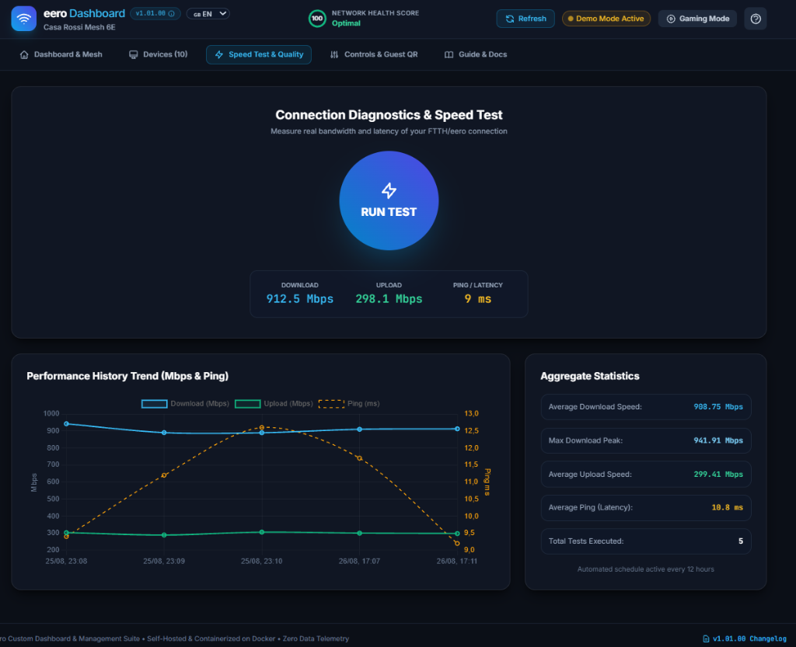
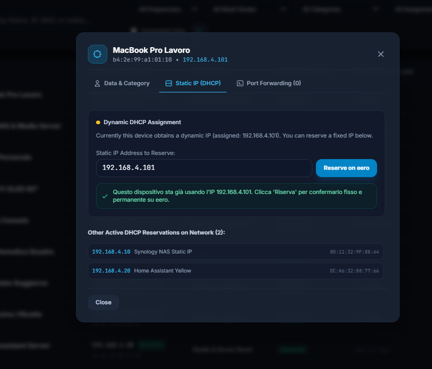

# eero Custom Dashboard & Mesh Management Suite 🚀

[](https://opensource.org/licenses/MIT)
[](https://www.python.org/downloads/)
[](https://fastapi.tiangolo.com)
[](https://www.docker.com/)
[](#)

> **Language / Lingua:** [🇬🇧 English](#-english) | [🇮🇹 Italiano](#-italiano)

<p align="center">
  
</p>

---

<a name="english"></a>
# 🇬🇧 English Documentation

Self-hosted, containerized web dashboard and management suite for **Amazon eero** mesh Wi-Fi networks. Features authentic certified hardware telemetry, real-time traffic monitoring, DHCP static IP reservation with collision detection, port forwarding rules, speed testing history, dynamic guest Wi-Fi QR generator, one-click gaming focus mode, and interactive documentation.

---

## 📸 Screenshots Showcase

<div align="center">

| Dashboard & Mesh Topology | Speed Test & Analytics |
| :---: | :---: |
|  |  |

| Device Details & Static IP (DHCP) |
| :---: |
|  |

</div>

---

## 🌟 Key Features

* **📊 Mesh Topology & Health Score:** Live overview with Network Health Score (1-100), WAN public IP, gateway status, DNS servers, ISP information, and individual eero nodes (Gateway & Beacons) with backhaul type (`Ethernet (Wired)` vs `Wireless Mesh`).
* **👤 Cloud User Profiles & Device Assignment:** Dedicated "Profiles & Users" tab with interactive cards for each eero Cloud profile/family member. One-click profile pause, bi-directional device assignment, unassigned device quick linking, and profile badges in the device table.
* **🖥️ Certified Hardware Telemetry & Device Management:** Full client table with filters by band (**2.4 GHz, 5 GHz, 6 GHz, Wired Ethernet**), profile, connected mesh node, Wi-Fi channel, RSSI signal strength (dBm), negotiated physical PHY rate, and **Static IP vs Dynamic DHCP indicators**.
* **⚙️ DHCP Reservations & Port Forwarding:** Dedicated device modals with custom nicknames (synced to eero cloud), cloud profile selector, categories, local documentation notes, favorite flags (⭐), **DHCP static IP reservations with reassignment support**, and integrated **Port Forwarding rule management** (WAN port -> LAN port, TCP/UDP).
* **🌍 Real-Time Multi-Language (i18n):** Native bilingual interface (**English 🇬🇧 / Italian 🇮🇹**) with automatic browser language detection and instant live switcher.
* **⚡ Speed Test & Performance Analytics:** Manual and scheduled automated speed tests (e.g. every 12 hours) with historical charts (Download, Upload, Ping/Latency) and aggregate statistics.
* **📱 Dynamic Guest Wi-Fi QR Code:** Scannable Wi-Fi QR Code generator (`WIFI:S:...;T:WPA;P:...;;`) with one-click enable/disable and secure password generation.
* **🎮 One-Click Gaming Focus Mode:** Low-latency automation that temporarily pauses non-essential streaming/IoT devices to eliminate jitter during competitive gaming or video calls.
* **🔔 Telegram Bot & Webhook Alerts:** Instant notifications on new unknown device connections (Intruder Alert) or mesh node disconnections.
* **📖 Interactive In-App User Manual:** Fully searchable embedded documentation and release notes changelog viewer.
* **🛡️ Zero-Latency RAM Cache:** Asynchronous in-memory background poller eliminating eero API rate-limiting.
* **✨ Demo Mode Simulator:** Test and explore all dashboard features without real credentials.

---

## 🛠️ Tech Stack

* **Backend:** Python 3.12 (`python:3.12-slim-bookworm`), FastAPI >= 0.115, Uvicorn >= 0.32, Pydantic v2, `asyncio`.
* **HTTP Client:** `httpx` (async client for eero REST API 2.2).
* **Storage:** Async SQLite with `aiosqlite` (WAL mode).
* **Frontend:** Semantic HTML5, Vanilla CSS / Tailwind CSS, Alpine.js (v3.14+), Chart.js (v4.4+).
* **Containerization:** Docker & Docker Compose (Compose V2).

---

## 🚀 Quick Start with Docker Compose

### 1. Clone or download the repository
```bash
git clone https://github.com/EnricoFlammini/Dashboard_EERO.git
cd Dashboard_EERO
```

### 2. Configure Environment Variables (Optional)
```bash
cp .env.example .env
```

### 3. Launch the Container
```bash
docker compose up -d --build
```

Access the dashboard in your browser:
👉 **`http://localhost:8085`** (or your server's IP, e.g. `http://192.168.1.100:8085`).

---

## 🔑 Authentication & Login Methods

1. **2FA OTP Login (Recommended):**
   - Open the web interface at `http://localhost:8085`.
   - Enter your email address or phone number associated with your eero account (e.g. `+1234567890` or `user@example.com`).
   - Click **"Send OTP Code"** and type the 6-digit verification code received via SMS/Email.
   - The session token is securely saved to `./data/session.json` and automatically restored across container restarts.
2. **Demo Mode:**
   - Click **"✨ Try Demo Mode"** on the login screen or set `DEMO_MODE=true` in `.env` to explore with simulated realistic mesh data.

---

## ⚙️ Environment Variables

| Variable | Default | Description |
|---|---|---|
| `HOST_PORT` | `8085` | Port exposed on host machine |
| `DATA_DIR` | `/app/data` | Directory for SQLite DB and session storage |
| `POLL_INTERVAL` | `30` | eero API sampling interval (seconds) |
| `HISTORY_RETENTION_DAYS` | `30` | Number of days to retain historical records |
| `SPEEDTEST_INTERVAL_HOURS` | `12` | Scheduled speed test interval in hours (0 to disable) |
| `DEMO_MODE` | `false` | Enable simulated mesh network environment |
| `TELEGRAM_BOT_TOKEN` | *(optional)* | Telegram Bot Token for alerts & daily digest |
| `TELEGRAM_CHAT_ID` | *(optional)* | Destination Telegram Chat ID |
| `WEBHOOK_URL` | *(optional)* | HTTP POST endpoint for JSON event forwarding |

---

## 💾 Data Persistence & Backup

All stateful data is isolated in the `./data` volume:
* **`metrics.db`**: SQLite database containing device metadata, speed tests, and alerts.
* **`session.json`**: Official eero cloud 2FA session token.

```bash
# Backup command
tar -czvf eero_dashboard_backup_$(date +%F).tar.gz ./data
```

---

<a name="italiano"></a>
# 🇮🇹 Documentazione in Italiano

Applicazione web self-hosted, modulare e containerizzata con Docker per il monitoraggio avanzato, il controllo e l'analisi dell'infrastruttura mesh **Amazon eero**. Include telemetria fisica certificata dai nodi, gestione avanzata dei dispositivi, prenotazione IP statici con rilevamento conflitti, inoltro porte (Port Forwarding), storico Speed Test, Wi-Fi ospiti con QR Code dinamico, Gaming Mode a un clic e manuale interattivo.

---

## 📸 Galleria Screenshot

<div align="center">

| Panoramica Dashboard & Topologia Mesh | Diagnostica Speed Test & Storico |
| :---: | :---: |
|  |  |

| Dettaglio Dispositivo & Assegnazione IP Statico DHCP |
| :---: |
|  |

</div>

---

## 🌟 Caratteristiche Principali

* **📊 Dashboard Mesh & Health Score:** Panoramica con Network Health Score (1-100), IP pubblico, DNS, ISP, Speed Test Gateway e stato dei singoli nodi eero (Gateway e Beacon) con tipo di backhaul (`Ethernet (Cablato)` vs `Wireless Mesh (5/6 GHz)`).
* **👤 Gestione Profili Utente Cloud & Assegnazione Dispositivi:** Nuovo tab "Profili & Utenti" con card per ciascun membro della famiglia, pausa istantanea dell'accesso a Internet di tutti i dispositivi dell'utente, assegnazione rapida bidirezionale e badge profilo nella tabella client.
* **🖥️ Telemetria Hardware Certificata & Gestione Dispositivi:** Tabella completa con filtri per frequenza (**2.4 GHz, 5 GHz, 6 GHz, Cablato Ethernet**), profilo utente, canale Wi-Fi, nodo eero collegato, potenza del segnale RSSI (dBm), velocità di link PHY negoziata e **indicatori visivi IP Statico vs DHCP**.
* **⚙️ Prenotazioni DHCP & Port Forwarding:** Scheda dettaglio dispositivo con sincronizzazione nomi sul cloud eero, selettore profilo cloud, categorie, note locali, preferiti (⭐), **prenotazione IP statico con rilevamento intelligente dei conflitti** e **gestione regole di apertura porte (Port Forwarding)**.
* **🌍 Supporto Multilingua (i18n):** Interfaccia bilingue (**Italiano 🇮🇹 / Inglese 🇬🇧**) con rilevamento automatico della lingua del browser e selettore istantaneo nella barra superiore.
* **⚡ Speed Test & Diagnostica Prestazioni:** Esecuzione test manuali e schedulati (es. ogni 12h) con storico completo di Download, Upload, Ping (Latenza) e calcolo delle medie e dei picchi massimi.
* **📱 Smart Guest Wi-Fi con QR Code Dinamico:** Generatore automatico di QR Code standard Wi-Fi (`WIFI:S:...;T:WPA;P:...;;`) da scansionare al volo con smartphone, con toggle rapido di attivazione e generatore di password sicure.
* **🎮 Gaming & Focus Mode (One-Click Low Latency):** Pulsante a un clic che mette automaticamente in pausa il traffico di background di apparati secondari e IoT preconfigurati per azzerare il jitter e la latenza durante sessioni di gaming o videoconferenze.
* **🔔 Notifiche Telegram & Webhook:** Avvisi in tempo reale per la connessione di nuovi dispositivi sconosciuti (Intruder Alert) e anomalie/nodi mesh offline.
* **📖 Manuale Utente Integrato & Changelog:** Documentazione completa navigabile con ricerca full-text, tooltip contestuali e visualizzatore Changelog interattivo in-app.
* **🛡️ Zero-Latency In-Memory Poller:** Cache in memoria RAM per rispondere all'interfaccia con latenza zero senza sovraccaricare le API eero (protezione da rate limiting).
* **✨ Modalità Demo:** Simulatore integrato per testare l'applicazione senza inserire credenziali reali.

---

## 🛠️ Stack Tecnologico

* **Backend:** Python 3.12 (`python:3.12-slim-bookworm`), FastAPI >= 0.115, Uvicorn >= 0.32, Pydantic v2, `asyncio`.
* **Client HTTP:** `httpx` (client asincrono per REST API eero 2.2).
* **Database & Storico:** SQLite asincrono con `aiosqlite` (WAL mode).
* **Frontend:** HTML5 semantico, Vanilla CSS / Tailwind CSS, Alpine.js (v3.14+), Chart.js (v4.4+).
* **Containerizzazione:** Docker e Docker Compose (Compose V2).

---

## 🚀 Avvio Rapido con Docker Compose

### 1. Clona il repository o posizionati nella cartella
```bash
git clone https://github.com/EnricoFlammini/Dashboard_EERO.git
cd Dashboard_EERO
```

### 2. Configura le Variabili d'Ambiente (Opzionale)
```bash
cp .env.example .env
```

### 3. Avvia il Container
```bash
docker compose up -d --build
```

Accedi alla dashboard dal browser:
👉 **`http://localhost:8085`** (o l'IP del tuo server Linux/NAS, es. `http://192.168.1.100:8085`).

---

## 🔑 Creazione Account eero & Modalità di Accesso

1. **Accesso Guidato 2FA OTP (Consigliato):**
   - Apri la schermata iniziale all'indirizzo `http://localhost:8085`.
   - Inserisci l'email o il numero di telefono associato al tuo account eero (es. `+393401234567` o `mario.rossi@email.com`).
   - Clicca su **"Invia Codice OTP"** ed inserisci il codice a 6 cifre ricevuto via SMS o Email.
   - Il token verificato viene salvato in `./data/session.json` e ripristinato automaticamente ad ogni riavvio del container.
2. **Modalità Demo:**
   - Clicca su **"✨ Prova Subito con la Modalità Demo"** nella schermata di login o imposta `DEMO_MODE=true` nel file `.env`.

---

## ⚙️ Variabili d'Ambiente

| Variabile | Default | Descrizione |
|---|---|---|
| `HOST_PORT` | `8085` | Porta esposta sulla macchina host |
| `DATA_DIR` | `/app/data` | Directory interna per i file SQLite e sessione |
| `POLL_INTERVAL` | `30` | Intervallo di campionamento dalle API eero (secondi) |
| `HISTORY_RETENTION_DAYS` | `30` | Giorni di conservazione dello storico prima della pulizia automatica |
| `SPEEDTEST_INTERVAL_HOURS` | `12` | Intervallo di esecuzione dello Speed Test automatico (ore, 0 per disattivare) |
| `DEMO_MODE` | `false` | Se impostato su `true`, abilita la simulazione completa di una rete eero |
| `TELEGRAM_BOT_TOKEN` | *(opzionale)* | Token del Bot Telegram per invio allarmi e digest |
| `TELEGRAM_CHAT_ID` | *(opzionale)* | Chat ID Telegram destinatario |
| `WEBHOOK_URL` | *(opzionale)* | Endpoint HTTP POST per inoltro eventi in formato JSON |

---

## 💾 Persistenza dei Dati & Backup

Tutti i dati risiedono nella cartella montata `./data`:
* **`metrics.db`**: Database SQLite con storico prestazioni, metadati e allarmi.
* **`session.json`**: Token di autenticazione eero 2FA.

```bash
# Esempio di backup rapido
tar -czvf eero_dashboard_backup_$(date +%F).tar.gz ./data
```

---

## 📄 Licenza / License

Distribuito sotto licenza **MIT**. Consulta il file [LICENSE](LICENSE) per i dettagli completi.  
Copyright (c) 2026 Enrico Flammini.
