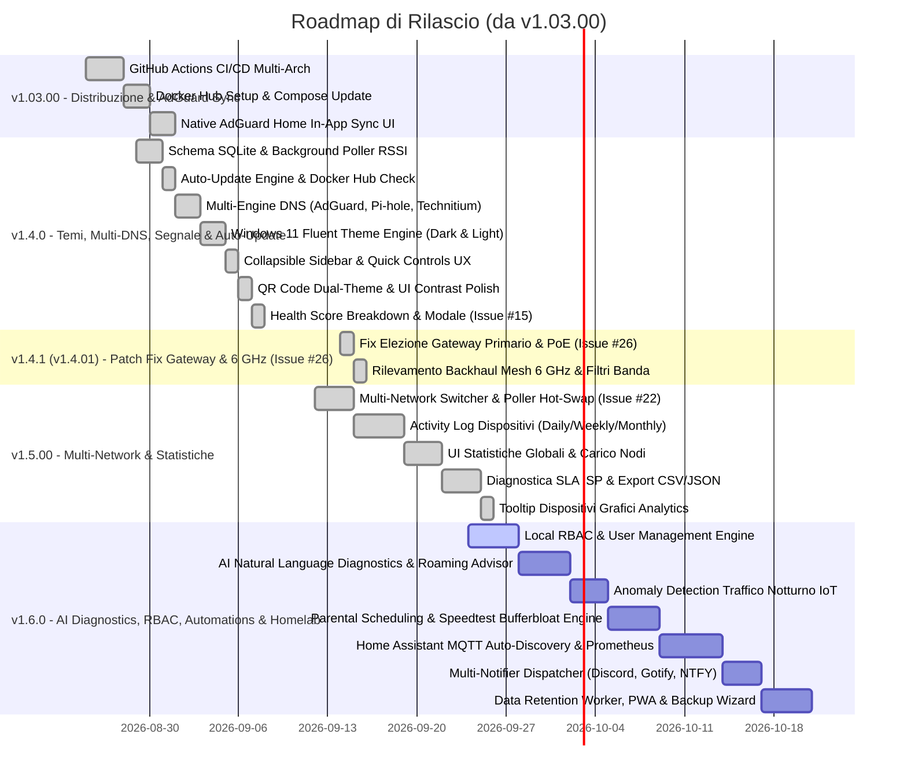

# 🗺️ Piano di Rilascio & Roadmap di Sviluppo (Release Plan)

Questo documento definisce il piano di rilascio strutturato per le prossime versioni di **eero Custom Dashboard & Management Suite**, a partire dalla versione attuale **1.02.00**.  
I rilasci seguono il formato di versionamento del progetto (`MAJOR.MINOR.PATCH`).

---

## 📌 Riepilogo Versioni Pianificate

| Versione | Focus Principale | Obiettivo Chiave |
| :--- | :--- | :--- |
| **v1.03.00** | 🚢 **Docker Hub CI/CD & 🛡️ Native AdGuard Sync** | Distribuzione automatica Docker Hub (amd64/arm64) + Sincronizzazione nativa AdGuard Home in-app |
| **v1.4.0** | 🎨 **Windows 11 Fluent Dual-Theme, 📐 Sidebar UX, 🛡️ Multi-Engine DNS, 🔄 1-Click Update, 📶 Signal Stats & ❤️ Health Breakdown (Issue #15)** | Design System Windows 11 Fluent (Dark/Light), Navigazione Sidebar collassabile con controlli rapidi, Multi-DNS (AdGuard/Pi-hole/Technitium), Docker Auto-Update 1-clic, Storicizzazione RSSI, Health Score Breakdown |
| **v1.4.1 (v1.4.01)** | ⚡ **Fix Elezione Primary Gateway Mesh (Issue #26), Rilevamento Backhaul Wi-Fi 6 GHz & Fix Filtri Banda Dispositivi** | Risoluzione elezione corretta Gateway primario con PoE e link multi-porta (Issue #26), riconoscimento e styling backhaul 6 GHz sui nodi mesh, fix ReferenceError nei filtri frequenza dispositivi. |
| **v1.5.00 (v1.5.0)** | 🌐 **Multi-Network Switching & 📊 Device Data Usage Insights Suite (Issue #22)** *(Completata)* | Gestione account multi-rete e switch a caldo tra sedi mesh (Issue #22) + Storico consumo dati per dispositivo (Daily/Weekly/Monthly), statistiche aggregate ed export CSV/JSON |
| **v1.6.0** | 🤖 **AI Network Diagnostics, 🔐 Local RBAC, ⏱️ Smart Automations & 🏡 Homelab Bridge** *(Prossima Release)* | Diagnostica intelligente in linguaggio naturale, Gestione Utenti Locali & RBAC granulare (Read/Write scopes), Sticky Clients & Roaming Advisor, Anomaly Detection traffico notturno, Parental Scheduling, Home Assistant MQTT Auto-Discovery, Metriche Prometheus (/metrics), Multi-Notifier e Compattazione SQLite |

---



---

## ⚡ Attività Immediate (Pre-v1.03.00 — Documentazione & Integrazioni DNS / Webhook)

> **Obiettivo:** Fornire alla community gli schemi completi del payload Webhook e le guide pratiche per integrare e sincronizzare automaticamente i lease DHCP/nomi host con **AdGuard Home**, **Pi-hole** e script di terze parti (senza richiedere bump di versione dell'applicazione).

- [x] **Documentazione Payload Webhook (`README.md`):**
  - Specifiche dettagliate e JSON schema per tutti gli eventi supportati: `new_device`, `node_offline`, `daily_digest`, `test_ping`.
- [x] **Guida Integrazione AdGuard Home & Pi-hole (`README.md`):**
  - Istruzioni per interrogare la REST API dei dispositivi (`GET /api/devices`).
  - Endpoint dedicati: `GET /api/devices/export/hosts` e `GET /api/devices/export/adguard`.
  - Script pronto di sincronizzazione automatica in [`scripts/adguard_sync.py`](scripts/adguard_sync.py).

---

## 🚀 Dettaglio delle Release

### 📦 Release v1.03.00 — Docker Hub Distribution & 🛡️ Native AdGuard Sync in-App

> **Obiettivo:** Rendere l'applicazione immediatamente fruibile con 1 clic da Docker Hub (senza compilazione locale) e integrare la configurazione visuale di sincronizzazione continua dei nomi host verso **AdGuard Home** direttamente dall'interfaccia utente.

#### 1. Workflow GitHub Actions (`.github/workflows/docker-publish.yml`)
- [x] Configurazione di `docker/setup-qemu-action` e `docker/setup-buildx-action`.
- [x] Compilazione automatica multi-piattaforma per:
  - `linux/amd64` (Server standard x86_64, VM, PC)
  - `linux/arm64` (Raspberry Pi 4/5, NAS Synology/QNAP/TrueNAS ARM, Apple Silicon)
- [x] Trigger automatico su:
  - Push su branch `main` (tag `latest`)
  - Creazione di Release / Git Tag (tag di versione es. `v1.03.00`, `1.03.00`)
- [x] Autenticazione sicura tramite GitHub Repository Secrets (`DOCKERHUB_USERNAME`, `DOCKERHUB_TOKEN`).

#### 2. Ottimizzazione Immagine & Configurazione
- [x] Aggiornamento di `docker-compose.yml`:
  ```yaml
  services:
    eero-dashboard:
      image: enricoflammini/eero-dashboard:latest
      build:
        context: .
        dockerfile: Dockerfile
  ```
- [x] Verifica della dimensione finale dell'immagine (Python slim) e rimozione dei file di build residui via `.dockerignore`.

#### 3. 🛡️ Integrazione Nativa AdGuard Home in-App (Pannello UI)
- [x] **Interfaccia di Configurazione Visuale:** Scheda dedicata nel modale Impostazioni con URL AdGuard, credenziali Basic Auth, toggle di abilitazione e pulsante *"Test Connessione"*.
- [x] **Sincronizzazione Automatica Background:** Il poller aggiorna automaticamente i client su AdGuard (`/control/clients/add` e `/control/clients/update`) all'accesso di nuovi host o su base oraria.
- [x] **Pulsante "Sincronizza Ora":** Trigger manuale per forzare l'allineamento istantaneo di tutta la tabella dispositivi verso AdGuard Home con notifica Toast di esito.

#### 4. Aggiornamento Documentazione
- [x] Aggiornamento `README.md` con il comando rapido `docker run`:
  ```bash
  docker run -d --name eero-dashboard -p 8085:8000 -v $(pwd)/data:/app/data enricoflammini/eero-dashboard:latest
  ```
- [x] Aggiunta di badge Docker Hub (pull count, image size) nel README.

#### 5. 📢 Annuncio di Release & Community Post (Reddit)
- [ ] **Nuovo Post Dedicato:** Pubblicazione di un post di rilascio sui subreddit di riferimento (**r/eero**, **r/selfhosted**, **r/Adguard**, **r/homelab**):
  - Focus sulle due novità principali: Immagine Docker Hub pronta con `docker run` immediato e Sincronizzazione Nativa AdGuard Home in-app.
  - Video breve / GIF dimostrativa o screenshot del nuovo pannello.
- [ ] **Follow-up nei commenti precedenti:** Notifica di risposta agli utenti (`PudgyPatch`, ecc.) che avevano richiesto la feature con link al rilascio.

---

### 📶 Release v1.4.0 — Storicizzazione Livello di Segnale (RSSI) & 🔄 1-Click Docker Auto-Update

> **Obiettivo:** Introdurre la storicizzazione continua su database SQLite del livello di segnale RSSI (dBm) per ciascun client di rete, arricchendo la pagina **Speed Test & Quality** con statistiche dedicate sulla qualità della copertura mesh, e implementare il **rilevamento e l'aggiornamento automatico con 1 clic del container Docker** direttamente dall'interfaccia utente.

#### 1. Storicizzazione su Database SQLite (`device_signal_history`)
- [x] **Nuova Tabella SQLite:** Creazione della tabella `device_signal_history` (`timestamp`, `mac_address`, `hostname`, `signal_rssi`, `frequency_band`, `connected_eero_name`, `rx_bitrate`) con indici ottimizzati su `(mac_address, timestamp)` e `timestamp`.
- [x] **Campionamento Background Continuo:** Il poller registra in batch a ogni ciclo di polling i campioni di segnale RSSI di tutti i dispositivi wireless attivi.
- [x] **Policy di Retention Automatica:** Pulizia automatica dei campioni più vecchi di 7/14 giorni per garantire elevate performance e dimensioni ridotte del database.

#### 2. Sezione "Qualità Wi-Fi & Copertura Mesh" (Pagina Speed Test & Quality)
- [x] **Distribuzione Qualità Segnale Rete:** 
  - Indicatori visuali e percentuali per fasce di segnale: *Eccellente* (≥ -50 dBm 🟢), *Buono* (-51 a -65 dBm 🔵), *Sufficiente* (-66 a -75 dBm 🟡), *Critico* (< -75 dBm 🔴).
  - Badge sintetico con il **Livello di Segnale Medio (RSSI)** dell'intera abitazione.
- [x] **Dispositivi con Segnale Debole (Weak Signal Watchlist):**
  - Tabella filtrata con gli apparati che presentano segnale critico o instabile.
  - Indicazione del nodo mesh e della frequenza agganciata con consigli di posizionamento/ottimizzazione mesh.
- [x] **Grafico Storico Segnale Interattivo (Chart.js):**
  - Menu a tendina per selezionare qualsiasi client connesso o noto.
  - Grafico temporale interattivo dell'andamento RSSI (dBm) nelle ultime 24h / 7 giorni con fasce di riferimento (Ottimale, Limite, Critico).
  - KPI dedicati per il client selezionato: Segnale Attuale, Minimo, Massimo, Media nel periodo.

#### 3. Endpoint REST API & Localizzazione
- [x] Endpoint `GET /api/metrics/signal/overview` per le statistiche aggregate di copertura.
- [x] Endpoint `GET /api/metrics/signal/history` per l'estrazione delle serie temporali per MAC address.
- [x] Traduzione 100% bilingue (Italiano e Inglese) in `it.json` ed `en.json`.
- [x] Aggiornamento del Capitolo 6 e Capitolo 8 del Manuale Utente integrato.

#### 4. 🔄 Auto-Update Engine & Notifiche Nuove Versioni Docker Hub (1-Click Update)
- [x] **Controllo Automatico Nuove Versioni (`/api/system/update/check`):**
  - Poller periodico che interroga le API pubbliche di Docker Hub (`/v2/repositories/enricoflammini/eero-dashboard/tags`) e GitHub Releases.
  - Notifica visiva nell'header: badge animato *"🎉 Nuova versione v1.4.x disponibile!"* con changelog sintetico.
- [x] **Pulsante "Aggiorna Container Ora" (In-App Self Update):**
  - Supporto per installazioni con Docker Socket montato (`/var/run/docker.sock`): esecuzione del pull dell'immagine `latest`, ricreazione sicura del container mantenendo i volumi (`/app/data`), porte ed env, e riavvio automatico.
  - Supporto per Watchtower: trigger webhook dedicato (`POST http://watchtower:8080/v1/update`).
  - Modalità assistita: visualizzazione e copia rapida con 1 clic del comando `docker compose pull && docker compose up -d`.
- [x] **Overlay di Aggiornamento & Riconnessione Automatica:**
  - Schermata modale con barra di avanzamento del download/riavvio.
  - Polling di riconnessione automatica del browser e ricaricamento a caldo appena il nuovo container è *healthy*.

#### 5. 🛡️ Multi-Engine DNS Synchronizer Suite (AdGuard, Pi-hole & Technitium)
- [x] **Integrazione Pi-hole (v5 & v6 REST API):**
  - Sincronizzazione automatica bidirezionale `IP <-> Hostname` su Local DNS Records (`/api/config/dns/hosts` e `/admin/api.php?customdns`).
  - Assegnazione dinamica alias client nella tabella network di Pi-hole per visualizzare i nomi reali degli apparati.
- [x] **Integrazione Technitium DNS Server & Reverse PTR Zones:**
  - Sincronizzazione automatica dei record diretti **A / AAAA** nella zona locale selezionata (es. `dispositivo.lan`).
  - Creazione, allineamento e aggiornamento automatico dei record **PTR** nelle rispettive zone inverse `in-addr.arpa` per Reverse DNS lookup istantaneo (`nslookup IP`).
- [x] **Interfaccia Unificata Multi-Engine DNS & Supporto Istanze Multiple Simultanee:**
  - Scheda estesa nelle Automazioni con configurazione dinamica di N istanze simultanee eterogenee (es. 2 AdGuard Home + 1 Pi-hole).
  - Test di connettività per singola istanza o globale simultaneo.
  - Sincronizzazione multi-istanza e multi-server con 1 solo clic o in background.
  - Piena retrocompatibilità per API preesistenti `/api/automations/adguard*`.

#### 6. 🎨 Windows 11 Fluent Design & Dual Theme Engine (Dark & Light Mode)
- [x] **Design System Windows 11 Fluent:**
  - Segoe UI Variable font stack, Mica/Acrylic material effects, bordi sottili stratificati (`#0000000f` / `#ffffff14`).
  - Palette coerente con Windows 11: Light mode `#f3f3f3` canvas, `#ffffff` glass panels, accent `#0067c0`; Dark mode `#202020` canvas, `#2b2b2b` cards, accent `#60cdff`.
- [x] **Selettore a 3 Stati:**
  - Toggle intuitivo nell'header: ☀️ Chiaro, 🌙 Scuro, 💻 Sistema (Auto).
  - Script anti-FOUC headless inline e persistenza istantanea in `localStorage`.
- [x] **Palette Dinamica Grafici (Chart.js):**
  - Adattamento real-time delle palette e delle griglie di tutti i grafici (WAN, Top Hogs, Speedtest, Segnale RSSI).

#### 7. 📐 Navigazione a Barra Laterale Collassabile (Sidebar UX) & Controlli Rapidi
- [x] **Barra Laterale Collassabile (Stile Windows 11 Fluent):**
  - Sostituzione della navigazione orizzontale a schede con un menu verticale a sinistra fisso e compattabile (`#sidebarNav`).
  - Due stati operativi fluidi (`transition-all duration-300`): espanso a 256px (`w-64`) e compresso a 68px (`w-[68px]`).
  - Margini adattivi del layout principale (`ml-64` / `ml-[68px]` / `ml-0` mobile) e memorizzazione automatica dello stato in `localStorage` (`eero_sidebar_collapsed`).
  - Centratura geometrica rigorosa 44x44px di pulsanti e icone SVG in modalità collassata con micro-badge d'angolo per i dispositivi.
  - Doppio pulsante di espansione/collasso: pulsante dedicato con glifi dinamici (`<<` / `>>`) nel footer della sidebar e pulsante hamburger sincronizzato nell'header superiore.
- [x] **Riposizionamento Controlli Rapidi & Indicatore Visivo Modalità Demo:**
  - Spostamento di **Gaming Focus Mode** e **Demo Mode** nella sezione inferiore della sidebar (`#sidebarControls`), garantendone l'accessibilità da qualsiasi schermata.
  - Indicatore cromatico verde smeraldo brillante ad alta visibilità (`bg-emerald-500/20 text-emerald-300 border-emerald-500/40`) con punto luminoso pulsante e dicitura esplicita *"DEMO ATTIVA"* quando la modalità demo è attiva (contrapposto allo stile discreto e neutro in modalità live *"LIVE / NORMALE"*).
  - Pillola di stato interattiva nell'header superiore (`#headerDemoPill`) sincronizzata con click-to-live immediato.

#### 8. 🔧 Correzioni Live & Normalizzazione Cloud DHCP Reservations / Port Forwarding
- [x] **Risoluzione Routing FastAPI (Shadowing Endpoint Rules):** Riposizionamento della rotta catch-all `/{device_id_or_mac:path}` alla fine del router, sbloccando la corretta ricezione dei payload `forwards` e `reservations` nel modale dispositivo.
- [x] **Estrazione Ricorsiva & Correlazione `dev_map` / `res_map`:** Supporto per regole create dall'app eero prive di IP esplicito con solo puntatore `device`, e per prenotazioni DHCP con oggetti dispositivo annidati o riferimenti URI.
- [x] **Harvesting Ricorsivo & Fallback Intelligente:** Scansione di `/forwards`, fallback su `/port_forwards` e `/networks/{id}`, e raccolta automatica delle regole nidificate dentro ogni reservation (`forwards`, `port_forwards`, `ports`, `port_forward_rules`, `rules`).
- [x] **Sincronizzazione Badge "STATIC" Globale:** Mappatura immediata MAC/IP nel poller di background, garantendo l'assegnazione accurata del flag `is_static: True` nella lista principale dei dispositivi.

---

### ⚡ Release v1.4.1 (v1.4.01) — 🌐 Fix Elezione Primary Gateway (Issue #26), 🏷️ Parsing DNS Personalizzati (Issue #30) & 📶 Riconoscimento Mesh 6 GHz

> **Obiettivo:** Risolvere la corretta elezione del nodo Primary Gateway su reti mesh con apparati multi-porta PoE (Issue #26), correggere l'estrazione dei server DNS personalizzati eliminando fallback hardcoded (Issue #30), perfezionare il riconoscimento delle frequenze wireless a 6 GHz sui nodi mesh Wi-Fi 6E/7 e risolvere il filtro di banda dei dispositivi.

#### 1. 🌐 Elezione Accurata Primary Gateway Mesh (Issue #26)
*(Risolta - GitHub Issue #26: "Incorrect PRIMARY GATEWAY listed")*
- [x] **Incrocio Autoritativo con Metadati di Rete (`/2.2/networks/{id}`):** Memorizzazione dell'ID e URL ufficiale del Gateway primario fornito dal cloud eero (`gateway_eero_id`, `gateway_eero_url`) con correlazione diretta durante la riconciliazione dei nodi in `get_eeros()`.
- [x] **Correlazione IP Gateway Subnet Router:** Elezione prioritaria basata sulla corrispondenza dell'IP del nodo con il gateway della subnet (es. `192.168.4.1`), prevenendo che nodi extender alimentati via iniettore PoE (es. eero Outdoor 7) vengano scambiati per il router primario.
- [x] **Ispezione Avanzata Porte WAN Fisiche:** Tracciamento del ruolo porta WAN (`isWanPort`, `role: wan`) e annotazione esplicita `"Port X (WAN)"` per eliminare il fallback indiscriminato sul primo nodo dell'array (`nodes[0]`).
- [x] **Demotion e Ricalcolo Backhaul Nodi Extender:** Assicurare che gli apparati extender (es. eero Outdoor 7 alimentati a PoE) mostrino il loro reale backhaul wireless e che l'effettivo router collegato alla WAN (es. eero Max 7 a 10 Gbps) sia contrassegnato come `PRIMARY GATEWAY (WAN)`.

#### 2. 🏷️ Estrazione Server DNS Personalizzati & Rimozione Fallback IP Sviluppatore (Issue #30)
*(Risolta - GitHub Issue #30: "seems like the wrong dns is listed on main page")*
- [x] **Parsing Ricorsivo Configurazioni DNS Annidate:** Estesa l'estrazione in `_normalize_network_details` per navigare correttamente la struttura JSON dell'API eero Cloud (`dns.custom.nameservers`, `dns.nameservers`, `dns.ips`).
- [x] **Eliminazione Fallback IP Statico `192.168.4.104`:** Rimosso sia nel backend Python sia nel metodo frontend `formatDnsServers(dns)` in `app.js`.
- [x] **Fallback Coerente su Gateway IP LAN:** In assenza di DNS a monte personalizzati (modalità ISP o DHCP standard), il fallback ricade dinamicamente sul gateway di rete (`gateway_ip` o `192.168.4.1`).

#### 3. 📶 Riconoscimento Backhaul Mesh Wi-Fi 6E / Wi-Fi 7 a 6 GHz
- [x] **Parsing Frequenze MHz & Canali PSC:** Interpretazione dei valori numerici `5900 - 7200 MHz` e canali PSC (`37, 53, 69, 85, 101, 117, 133, 181, 197, 213, 229`), eliminando il conflitto in cui il canale 69 veniva etichettato come 5 GHz.
- [x] **Fallback Hardware 6 GHz:** In assenza di metadati espliciti dall'API cloud, riconoscimento dei modelli hardware Wi-Fi 6E/7 (`eero Pro 6E`, `eero Max 7`, `eero Outdoor 7`) e assegnazione coerente del backhaul su `Wireless Mesh (6 GHz)` in linea con la priorità del motore TrueMesh.
- [x] **Badge Cromatico Dedicato:** Evidenziazione visiva con accento sky (`text-sky-600 dark:text-sky-400`).

#### 4. 🔍 Fix Filtri Frequenze Elenco Dispositivi Client (ReferenceError)
- [x] **Risoluzione Bug Variabile non Definita in `filteredDevices`:** Risolto l'errore JavaScript che svuotava la tabella dei dispositivi alla selezione dei filtri `2.4GHz`, `5GHz` e `6GHz`.

---

### 📊 Release v1.5.00 (v1.5.0) — 🌐 Multi-Network Fleet Management & 📊 Device Data Usage Insights Suite

> **Obiettivo:** Introdurre il **supporto completo agli account multi-rete / multi-sede con switch istantaneo in-app (Issue #22)** e lo **storico di consumo dati per singolo dispositivo (Activity Log by Device: Daily, Weekly, Monthly)** mutuato dall'app ufficiale eero, corredato da analisi dettagliate di ripartizione del carico mesh, monitoraggio SLA ISP ed esportazione aperta dei dati (CSV/JSON).

#### 1. 🌐 Gestione Account Multi-Rete & Live Network Switcher (Issue #22 - Multiple eero mesh on one account)
*(Richiesta da GitHub Issue #22 e feedback community su Reddit)*
- [x] **Mappatura Completa Reti Account (`eero_client.py`):**
  - Estrazione e normalizzazione di tutte le reti accessibili all'account (`networks`, `shared_networks`, `admin_networks`, con fallback `/2.2/networks`).
  - Salvataggio dell'elenco normalizzato `available_networks = [{"id": "...", "name": "...", "url": "..."}, ...]`.
- [x] **Persistenza Rete Attiva & Endpoint REST:**
  - Persistenza della preferenza della rete attiva in `session.json` e nella tabella `app_settings` (SQLite) per preservare la selezione tra riavvii del container.
  - Nuovo endpoint `GET /api/network/list`: elenco reti disponibili e ID rete correntemente attiva.
  - Nuovo endpoint `POST /api/network/switch`: cambio a caldo della rete attiva (`{"network_id": "..."}`), riconfigurazione immediata del poller (`poller.refresh_all()`) e invalidazione cache in memoria senza riavviare il container.
- [x] **Selettore a Tendina Dinamico nella UI (Fluent Header Dropdown):**
  - Se l'account possiede una sola rete: visualizzazione standard del nome rete (zero ingombro visivo).
  - Se l'account possiede 2 o più reti: il nome rete nell'header diventa un dropdown interattivo Windows 11 Fluent con chevron e badge di stato.
  - Cambio rete istantaneo con toast informativo e aggiornamento a caldo di widget, topologia mesh, tabella dispositivi e metriche senza refresh completo della pagina web.
- [x] **Supporto Multi-Rete in Demo Mode:**
  - Aggiunta di una seconda rete simulata in `_demo_state` (es. *"Ufficio & Studio Pro Mesh"*) per consentire il test immediato dello switch in modalità Demo e nei test automatizzati (`scripts/run_pre_release_tests.py`).

#### 2. 📈 Storico Consumo Dati per Singolo Dispositivo ("By Device" Activity Log & Bandwidth Usage)
*(Richiesta da feedback community su r/eero / r/selfhosted)*
- [x] **Integrazione Endpoint Cloud eero Data Usage:**
  - Interrogazione degli endpoint Cloud eero `/2.2/networks/{network_id}/data_usage/devices` e aggregazione continua del delta trasferito.
  - Cache intelligente e aggregazione background con memorizzazione su SQLite nella tabella `device_usage_history` per non sovraccaricare le API eero.
- [x] **Ripartizione a 3 Cadente Temporali (Daily, Weekly, Monthly):**
  - **Giornaliero (Daily):** Consumo delle ultime 24h con campionamento orario/delta e calcolo throughput effettivo (Mbps).
  - **Settimanale (Weekly):** Consumo giorno per giorno negli ultimi 7 giorni.
  - **Mensile (Monthly):** Consumo cumulativo negli ultimi 30 giorni.
- [x] **Visualizzazione Interattiva nella UI (Modale Dispositivo & Vista Dedicata):**
  - Nuova scheda *"Consumo Dati"* all'interno del modale dispositivo (`#deviceModal`).
  - Grafico temporale interattivo (Chart.js) per download (Mbps) e upload (Mbps) con palette Windows 11 Fluent.
  - Badge sintetici con KPI immediati: *Download Totale*, *Upload Totale*, *Traffico Combinato*.
- [x] **Classifica Top Consumer per Finestra Temporale (Top Bandwidth Hogs):**
  - Card dedicata nella dashboard principale con classifica dinamica e apertura diretta della scheda consumo dispositivo.

#### 3. Sezione "Statistiche & Analytics" (Nuova Tab / Vista UI)
- [x] **Distribuzione & Carico di Rete:** Frequenze Wi-Fi (2.4 GHz vs 5 GHz vs 6 GHz), Carico per nodo mesh, Categorie dispositivi, Vendor / Produttori (OUI).
- [x] **Trend Prestazioni Linea & SLA ISP:** Medie orarie, jitter, packet loss e indice di affidabilità del provider internet calcolato sui test storici.
- [x] **Esportazione Dati (CSV / JSON):** Esportazione elenco dispositivi, storico speedtest, campionamento segnale RSSI e storico consumo dati per reporting esterno o integrazione Grafana/Home Assistant.
- [x] **Tooltip Interattivo con Elenco Dispositivi (Grafici Analytics):** Al passaggio del mouse su barre, segmenti e slice dei 4 grafici di distribuzione, il tooltip scuro mostra l'elenco nominativo completo dei dispositivi che compongono quel dato (alias → hostname → IP → MAC), con intestazione conteggio, bullet points e troncamento automatico a 15.

#### 4. 🛡️ Telemetria Rigorosa, Accuratezza RF & Stabilità Nodi (PR #47–#53 - @carbones73)
*(Risolte da @carbones73 con PR #47, #48, #49, #50, #51, #52, #53 e test di regressione dedicati)*
- [x] **Isolamento Sessione Live (PR #47):** Eliminato il fallback sui dispositivi demo simulati in `get_devices()` in assenza temporanea di ID rete risolto su sessioni reali autenticate.
- [x] **Bonifica Speedtest Fittizio (PR #48):** Rimozione dei valori di fallback hardcoded 951/193 Mbps e timestamp `now()` su reti senza misurazioni WAN attive.
- [x] **Elezione Deterministica Primary Gateway (Issue #26 / PR #49):** Confronto rigoroso per segmento di percorso URL (`split('/')[-1] == str(gw_id)`) evitando falsi positivi da sottostringa (es. ID `10` vs `104`/`210`).
- [x] **Accuratezza Spettro RF 5 GHz UNII-3 vs 6 GHz (PR #50):** Corretta la classificazione dei canali dispari UNII-3 (149-165) a 5 GHz e disaccoppiato il flag Wi-Fi 7 EHT dalla frequenza 6 GHz.
- [x] **Risoluzione Network ID Regole e Prenotazioni (Issue #33 / PR #51):** Chiamata al metodo corretto `fetch_account_info()` e salvaguardia chiamate `/networks/None`.
- [x] **Trasparenza Segnale Senza Placeholder -55 dBm (PR #52):** Mantenimento di `signal_rssi = None` in assenza di lettura e pulizia dello storico RSSI e Health Score.
- [x] **Stabilizzazione Tassi Simulati Demo Mode (PR #53):** Ancoraggio delle variazioni casuali alla base fissa iniziale (`_demo_base_rates`) prevenendo drift moltiplicativo esponenziale.

#### 5. 🔒 Hardening di Sicurezza & Vulnerability Remediation (Security Advisories - @carbones73)
*(Patch di sicurezza fornite da @carbones73 per 4 GitHub Security Advisories con test di regressione inclusi)*
- [x] **Protezione CORS & CSRF Middleware (GHSA-jgpm-8wqq-cchm):** Chiusura di `allow_origins=["*"]`, introduzione di `CORS_ORIGINS` e blocco preventivo richieste mutanti (POST/PUT/PATCH/DELETE) con `Sec-Fetch-Site: cross-site`.
- [x] **Sanitizzazione Password Wi-Fi dall'Overview di Rete (GHSA-8fm4-wcq4-ch2p):** Rimozione ricorsiva preventiva di chiavi contenenti password (`password`, `passphrase`, `psk`, `network_key`, ecc.) dalla cache pubblica `/api/network/overview`.
- [x] **Interactive API Docs Toggle `API_DOCS` (GHSA-f9xp-vqq6-f6r4):** Montaggio di `/docs`, `/redoc` e `/openapi.json` condizionato alla variabile `API_DOCS=true` (disattivato di default per proteggere endpoint di scrittura).
- [x] **Permessi File Restrittivi `0600` per `session.json` (GHSA-pqh9-q8vm-x9mh):** Creazione atomica con `0o600` e `fchmod` prima del troncamento per proteggere il token cloud 2FA da altri utenti sull'host.

---

### 🤖 Release v1.6.0 — 🤖 AI Network Diagnostics, 🔐 Local RBAC, ⏱️ Smart Automations & 🏡 Homelab Bridge

> **Obiettivo:** Trasformare la suite in un sistema diagnostico e operativo completo per ambienti Homelab e Small Business, introducendo un motore di **diagnostica euristica e in linguaggio naturale** per l'analisi di rete, un modulo avanzato di **Controllo degli Accessi Basato sui Ruoli (Local RBAC & User Management)** con permessi granulari di lettura e azione per proteggere la rete senza esporre le credenziali Amazon/eero, un sistema di **pianificazione profili e automazioni (Parental Scheduling & Bufferbloat SLA)**, l'integrazione nativa con **Home Assistant (MQTT Discovery) e Prometheus (`/metrics`)**, il supporto a **nuovi canali di notifica self-hosted (Discord, Gotify, NTFY, Pushover)** e un **worker asincrono di compattazione e data retention** per mantenere il database SQLite snello e performante nel lungo periodo.

#### 1. 🤖 AI Network Diagnostics & Intelligent Health Score
* **Natural Language Health Analysis (Diagnosi Descrittiva Dinamica):**
  * Generazione dinamica di sintesi diagnostiche descrittive e contestuali all'interno del modale *Network Health Score*.
  * Spiegazione discorsiva dei fattori di penalità: attenuazione RSSI anomala ($< -75\text{ dBm}$), sovraffollamento della banda 2.4 GHz rispetto a 5/6 GHz, link PHY sottodimensionati o negoziazioni Ethernet degradate a 100 Mbps anziché 1 Gbps / 2.5 Gbps su porte e switch cablati.
  * Generazione di consigli guidati e pratici (es. *"Il nodo Studio negozia a 100 Mbps: verificare il cavo Ethernet Cat5e/Cat6 o la porta dello switch intermedio"*).
* **Sticky Clients & Roaming Advisor:**
  * Euristica per l'identificazione di dispositivi mobili agganciati a nodi mesh distanti con RSSI debole pur essendo in prossimità di nodi con segnale nettamente superiore ($\Delta \text{RSSI} \ge 20\text{ dBm}$).
  * Badge visuale *"Roaming Sub-Ottimale"* nel modale apparato e nella lista client con suggerimenti operativi di de-autenticazione o riposizionamento beacon.
* **Anomaly Detection sul Traffico Notturno IoT:**
  * Analizzatore statistico su serie storiche SQLite (`device_usage_history`) durante le ore notturne (01:00 - 06:00).
  * Rilevamento automatico di anomalie (outlier statistici) per download/upload anomali su telecamere IP, sensori domotici o smart TV, con notifica immediata di potenziale compromissione o loop di rete.

#### 2. 🔐 Local Role-Based Access Control (RBAC) & User Management
* **Architettura a Sessione Cloud Unificata & Utenti Locali Indipendenti:**
  * Mantenimento della connessione a monte verso eero Cloud imperniata sull'unico token principale già autenticato con 2FA dall'amministratore di rete (`session.json`).
  * Nessuna necessità di distribuire credenziali Amazon/eero o codici OTP secondari a familiari, colleghi o ospiti.
  * Gli utenti locali autenticano la loro sessione direttamente contro la dashboard mediante credenziali semplici e sicure (username e password memorizzate localmente).
* **Schema Dati SQLite (`metrics.db`) & Bootstrap Trasparente:**
  * Nuova tabella relazionale `local_users` (`id`, `username`, `password_hash`, `is_admin`, `permissions`, `created_at`, `last_login`).
  * Hashing crittografico leggero e robusto standard Python (`hashlib.pbkdf2_hmac` con salt crittografico casuale, digest SHA-256 e 100.000 iterazioni, senza librerie binarie C o dipendenze esterne pesanti).
  * Inizializzazione trasparente al primo avvio dell'utente `admin` predefinito, con possibilità di pre-configurazione o override tramite variabili d'ambiente opzionali `ADMIN_USER` e `ADMIN_PASSWORD`.
* **Matrice dei Permessi Granulari (Read & Action Scopes):**
  * **Ambiti di Visibilità (Read Scopes):**
    * `view_topology`: Visualizzazione della mappa dei nodi mesh, stato operativo e tipologia di backhaul.
    * `view_devices`: Accesso all'elenco dei dispositivi connessi/noti, indirizzi IP, MAC e frequenze radio.
    * `view_rules`: Consultazione delle prenotazioni DHCP e delle regole di Port Forwarding attive.
    * `view_guest_wifi`: Visualizzazione dello stato della rete Wi-Fi Ospiti e scansione del QR code.
    * `view_speedtest`: Consultazione dello storico delle misurazioni WAN e dei grafici di prestazione SLA.
    * `view_dns_sync`: Monitoraggio dello stato delle istanze Multi-Engine DNS e dei log di sincronizzazione.
  * **Ambiti di Operatività & Modifica (Write/Action Scopes):**
    * `action_reboot_nodes`: Autorizzazione al riavvio dell'intera rete mesh o di singoli beacon eero.
    * `action_edit_devices`: Modifica di nomi personalizzati, categorie, note e preferiti (⭐).
    * `action_manage_rules`: Creazione, modifica e cancellazione di prenotazioni IP statiche e regole di inoltro porte.
    * `action_toggle_guest`: Abilitazione/disabilitazione della rete ospiti e rigenerazione della password.
    * `action_run_speedtest`: Esecuzione di nuovi test di velocità on-demand sull'hardware del gateway.
    * `action_sync_dns`: Esecuzione forzata manuale della sincronizzazione verso i server DNS locali.
  * **Privilegi Superadmin Esclusivi:**
    * Gestione completa (creazione, modifica permessi, reset password, eliminazione) degli account locali.
    * Autorizzazione all'avvio dell'aggiornamento automatico del container Docker in-app (`/api/system/update/trigger`).
* **Backend Security & Endpoints FastAPI:**
  * Nuove rotte di autenticazione locale: `POST /api/auth/local/login`, `POST /api/auth/local/logout`, `GET /api/auth/local/me`.
  * Endpoint CRUD di gestione utenti riservati al superadmin: `GET|POST|PUT|DELETE /api/users`.
  * Dependency injection riutilizzabile `require_permission(perm_key)` su tutte le rotte operative per bloccare con `HTTP 403 Forbidden` qualsiasi tentativo di bypass o richiesta non autorizzata.
* **Interfaccia Utente Reattiva (Alpine.js + Tailwind):**
  * Modale dedicato *"Gestione Utenti & Permessi"* accessibile solo agli amministratori, con elenco utenti, badge di ruolo e switch a griglia (toggle interattivi iOS-style) per abilitare/disabilitare ciascun permesso.
  * Condizionamento visuale dinamico dell'interfaccia con direttive Alpine `x-show` e `x-if` per nascondere o disabilitare sezioni della sidebar e pulsanti operativi (es. pulsanti di reboot, modifiche regole o toggle rete ospiti) in base ai claim autorizzativi restituiti dalla sessione.

#### 3. ⏱️ Smart Automations, Schedules & ISP Monitoring
* **Parental & Device Scheduling (Profili e Gruppi di Dispositivi):**
  * Creazione e gestione di gruppi logici (es. *"Bambini / Console"*, *"Smart TV"*, *"IoT Guest"*).
  * Motore di schedulazione temporale con regole ricorrenti (giorni feriali, fine settimana, orari notturni) per sospendere o ripristinare automaticamente l'accesso a internet dei client appartenenti al gruppo tramite le API cloud eero (`paused: true/false`).
  * Interfaccia visuale drag-and-drop o griglia a blocchi orari per configurare con facilità le finestre di pausa.
* **Speedtest & Bufferbloat Scheduler Avanzato:**
  * Pianificazione automatizzata e flessibile dei test di velocità WAN (es. ogni 6 ore, ogni 12 ore o in finestre orarie dedicate).
  * Analisi comparata della latenza: calcolo del bufferbloat tramite campionamento del ping sotto carico (durante upload/download attivo) rispetto al ping a riposo (idle).
  * Monitoraggio continuativo dello SLA contrattuale con allarme automatico (Telegram, Webhook, Discord) in caso di violazione prolungata delle soglie minime garantite.
* **Auto-Maintenance Notturna:**
  * Monitoraggio continuo dei tassi di errore pacchetti (drop rate) e dei tempi di attività (uptime) dei nodi mesh.
  * Opzione per abilitare il riavvio programmato facoltativo e sequenziale dei nodi o dell'intera rete durante fasce orarie notturne a impatto zero (es. ore 04:30), prevenendo memory leak o blocchi firmware.

#### 4. 🏡 Espansione Ecosistema Homelab & Notifiche
* **Integrazione Home Assistant & MQTT Auto-Discovery:**
  * Client MQTT asincrono integrato con pubblicazione automatica di topic e configurazioni Home Assistant Discovery (`homeassistant/binary_sensor/...`, `homeassistant/sensor/...`, `homeassistant/switch/...`).
  * Device Tracker di presenza in tempo reale per tutti i dispositivi noti (stato `home`/`not_home` sincronizzato con l'associazione fisica Wi-Fi/LAN).
  * Entità sensore per stato e salute dei nodi mesh, throughput WAN, latenza ping e numero di client connessi.
  * Switch interattivi in Home Assistant per controllare con un clic la Rete Ospiti e la modalità Gaming Focus Mode.
* **Endpoint Metriche Prometheus (`/metrics`):**
  * Esposizione nativa delle metriche applicative e di rete in formato standard OpenMetrics / Prometheus.
  * Metriche esportate: `eero_device_count{band, node}`, `eero_wan_download_mbps`, `eero_wan_upload_mbps`, `eero_ping_latency_ms`, `eero_node_status{node, status}`, `eero_sla_reliability_score`.
  * Fornitura di un template dashboard Grafana preconfezionato (`integrations/grafana/dashboard.json`).
* **Canali di Notifica Self-Hosted Espansi (Multi-Notifier Dispatcher):**
  * Architettura modulare `NotificationDispatcher` per l'inoltro multi-canale parallelo o selettivo degli allarmi (`new_device`, `node_offline`, `anomaly_detected`, `sla_breach`, `daily_digest`).
  * Supporto nativo per **Discord** (con rich embeds formattati e badge colorati), **Gotify** (notifiche push su server self-hosted con priorità configurabile), **NTFY** (notifiche push HTTP pub-sub universali) e **Pushover** (con suoni personalizzati e token applicativo).
* **Estensione Multi-Engine DNS (Blocky & Unbound):**
  * Supporto all'ecosistema DNS homelab esteso oltre ad AdGuard, Pi-hole e Technitium.
  * Integrazione con **Blocky** (lightweight DNS proxy per Kubernetes/Docker) e **Unbound** (server ricorsivo per homelab avanzati con sincronizzazione automatica dei record A/PTR locali).

#### 5. ⚡ Database Retention, Compattazione & Ottimizzazioni UX
* **Data Retention & Aggregation Worker:**
  * Worker asincrono in background per compattazione e aggregazione trasparente del database SQLite `metrics.db`.
  * Architettura di tiering temporale: campioni grezzi a granularità elevata (10s) conservati per 7 giorni; rollup orario per dati tra 8 e 30 giorni; aggregati giornalieri/mensili per analisi storiche a lungo termine (fino a 90 giorni).
  * Manutenzione periodica programmata del database SQLite in modalità WAL con esecuzione di `PRAGMA optimize;` e `VACUUM;` notturno per garantire dimensioni del database contenute (< 100 MB).
* **Activity Log Multi-Filtro (Top Bandwidth Hogs):**
  * Filtri avanzati e interattivi per la classifica e il grafico dei consumi per dispositivo: filtraggio simultaneo per categoria apparato (Computer, Smartphone, IoT, Entertainment), per banda di frequenza (2.4 GHz, 5 GHz, 6 GHz, Cablato) o per nodo mesh di attestazione.
* **Progressive Web App (PWA) & Backup Wizard:**
  * Aggiunta di Web App Manifest (`manifest.json`), service worker per caching offline degli asset statici (CSS, JS, icone SVG) e supporto alla modalità *standalone* a tutto schermo su pannelli touch a parete (Wall Dashboard), tablet e smartphone.
  * Wizard guidato di esportazione e importazione configurazione JSON (`GET /api/system/backup`, `POST /api/system/restore`) per salvataggio e ripristino sicuro di alias personalizzati, impostazioni DNS, preferenze notifiche e parametri di automazione senza richiedere dump manuali del database.

---

#### 📋 Checklist di Sviluppo Modulare per la Release v1.6.0

##### Modulo 1: Backend FastAPI, Auth & Engine Core
- [ ] Implementazione modulo di autenticazione locale e sessioni utente (`app/routers/local_auth.py`).
- [ ] Router CRUD di gestione utenti locali riservato all'amministratore (`app/routers/users.py`).
- [ ] Dependency injection `require_permission(perm_key)` con blocco `HTTP 403 Forbidden` per protezione rotte API.
- [ ] Implementazione del motore diagnostico euristico in linguaggio naturale (`app/services/ai_diagnostics.py`).
- [ ] Algoritmo di rilevamento *Sticky Clients & Roaming Advisor* basato su differenziale RSSI nodi mesh vicini.
- [ ] Analizzatore euristico notturno per rilevamento anomalie di traffico su dispositivi IoT/telecamere.
- [ ] Motore di scheduling orario (`app/services/scheduler.py`) per automazioni e gruppi dispositivi (Parental Control).
- [ ] Calcolo e tracciamento dell'indice di bufferbloat nei cicli di speedtest (`ping_under_load` vs `ping_idle`).
- [ ] Routine di manutenzione notturna automatica con monitoraggio drop rate e riavvio opzionale programmato.
- [ ] Endpoint REST dedicati per backup/ripristino (`/api/system/backup` e `/api/system/restore`).

##### Modulo 2: Database SQLite & Data Retention Engine (`metrics.db`)
- [ ] Nuova tabella `local_users` per account locali con hashing PBKDF2/SHA-256 e schema permessi JSON.
- [ ] Routine di bootstrap trasparente al primo avvio per utente `admin` predefinito (supporto env `ADMIN_USER`/`ADMIN_PASSWORD`).
- [ ] Nuova tabella `device_schedules` per profili, finestre temporali e regole di accensione/spegnimento connettività.
- [ ] Nuova tabella `traffic_anomalies` per la storicizzazione delle anomalie di traffico rilevate.
- [ ] Worker asincrono di compattazione tiering (`retention_worker.py`): rollup orario/giornaliero e pulizia campioni grezzi.
- [ ] Job periodico di compattazione e manutenzione SQLite WAL (`PRAGMA optimize` e `VACUUM`).

##### Modulo 3: Frontend Alpine.js, Tailwind CSS & PWA
- [ ] Modale dedicato *"Gestione Utenti & Permessi"* con tabella utenti e switch a griglia (toggle iOS-style) per ciascun permesso.
- [ ] Condizionamento reattivo della UI (visibilità voci sidebar e pulsanti operativi) in base ai claim autorizzativi dell'utente loggato.
- [ ] Interfaccia di login locale per sessioni multi-utente con gestione scadenza token e logout pulito.
- [ ] Integrazione delle diagnosi descrittive dinamiche in linguaggio naturale nel modale *Network Health Score*.
- [ ] Badge *"Roaming Sub-Ottimale"* e schede consiglio per dispositivi con connessione non ideale.
- [ ] Interfaccia visuale drag-and-drop / griglia oraria per la gestione delle pianificazioni (Parental Scheduling).
- [ ] Selettori multi-filtro avanzati per la classifica Top Bandwidth Hogs (per categoria, frequenza e nodo mesh).
- [ ] PWA Manifest (`manifest.json`), icone responsive e service worker per installazione su pannelli a parete / tablet.
- [ ] Modale guidato per l'esportazione e il ripristino con 1 clic del backup di configurazione in formato JSON.

##### Modulo 4: Integrazioni Ecosistema Homelab & Notifiche Esterne
- [ ] Client MQTT asincrono con Home Assistant Auto-Discovery per device tracking, sensori nodi e switch ospiti/gaming.
- [ ] Endpoint nativo OpenMetrics/Prometheus (`GET /metrics`) e template dashboard Grafana incluso in repository.
- [ ] Dispatcher multi-canale di notifica con connettori nativi per Discord, Gotify, NTFY e Pushover.
- [ ] Driver di sincronizzazione DNS per istanze Blocky e server ricorsivi Unbound in `DNSManager`.
- [ ] Aggiornamento documentazione tecnica, manuale integrato (`app/routers/manual.py`) e test pre-release (385+ test previsti).

---

## 🛠️ Note Operative per il Futuro

- **Convenzione Versionamento SemVer (da v1.4.0 in avanti):**
  - Formato privo di zeri non significativi: `MAJOR.MINOR.PATCH` (es. `1.4.0`).
  - Correzioni bug & patch (minor updates): `1.4.1`, `1.4.2`, `1.4.12`, ecc.
  - Rilasci con nuove feature (major/feature updates): `1.5.0`, `1.6.0`, ecc.
  - Le release storiche pregresse già rilasciate in produzione (`1.03.03`, `1.03.02`, ecc.) sono mantenute inalterate per conformità documentale e tag Git.
- Ogni release sarà accompagnata da:
  1. Aggiornamento del file `changelog.md`.
  2. Creazione del relativo Git Tag (es. `git tag -a v1.4.0 -m "Release v1.4.0"`).
  3. Verifica manuale e automatica prima del rilascio (`scripts/run_pre_release_tests.py`).
